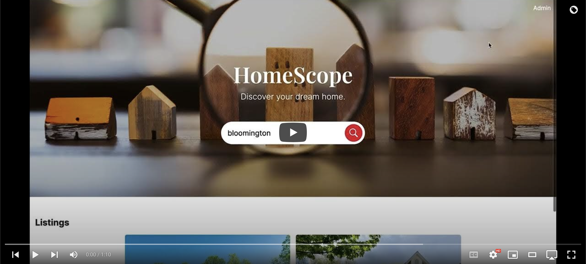

<h2 align="center">Home Scope</h2>

<h4>Discover your dream home with a clear view of the market.</h4>

  

    
  

  

    <a href="#features">Features</a> •
    <a href="#customer-demo">Customer Demo</a> •
    <a href="#technologies-used">Technologies Used</a> •
    <a href="#getting-started">Getting Started</a>
  

## Features
- Property Listings: View a list of available properties with details such as images, address, and price.
- Property Search: Search for properties based on address, city, or zipcode.
- Admin Dashboard: Access an admin interface to manage properties, including creating, editing, and deleting them.

## Customer Demo (v.1.0.0)

## Technologies Used
- Ruby on Rails: Framework for the web application.
- MongoDB: Database system used to store property data.
- CSS: Custom styling for a modern user interface design.
- dotenv: Used to manage environment variables, such as database credentials.

## Getting Started
To set up the development environment and run the application locally, follow these steps:

1. Clone the repository: `git clone https://github.com/jacobday/home-scope`
1. Install dependencies: `bundle install`
1. Set up the MongoDB connection details in the `.env` file.
1. Start the Rails server: `rails server`
1. Access the application in your web browser at `http://localhost:3000`
